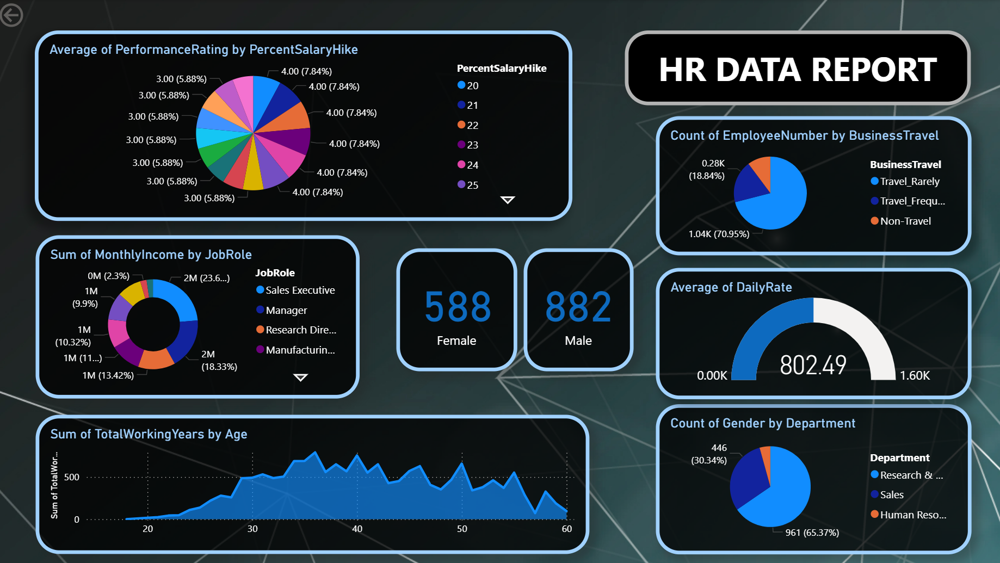

# HR Analytics Dashboard - Power BI

## Overview
Interactive Power BI dashboard for analyzing employee demographics, salary trends, department distribution, and workforce insights.

## Features
- Employee gender analysis
- Salary insights
- Department distribution
- Business travel analysis
- Job role analysis
- Employee working years trends

## Tools Used
- Power BI

## Dashboard Preview

## Note
Original dataset files are unavailable because this project was created earlier.
